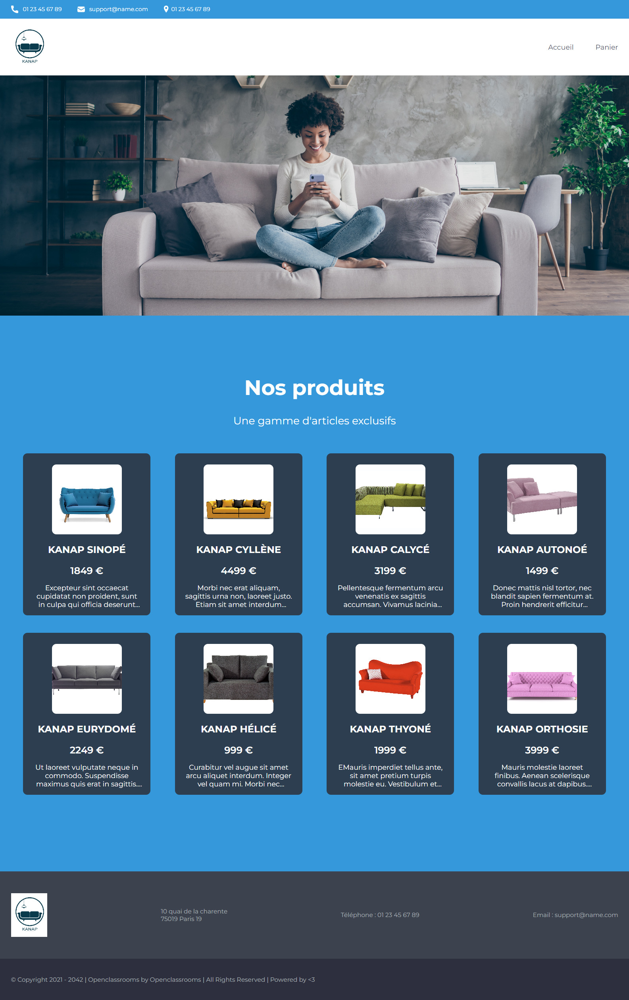
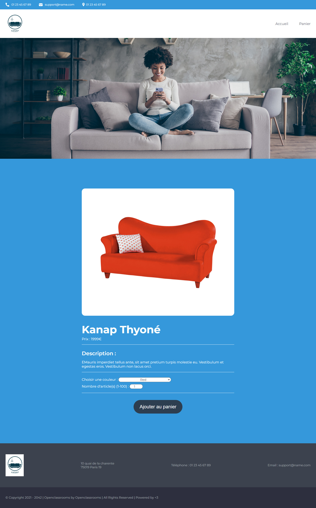
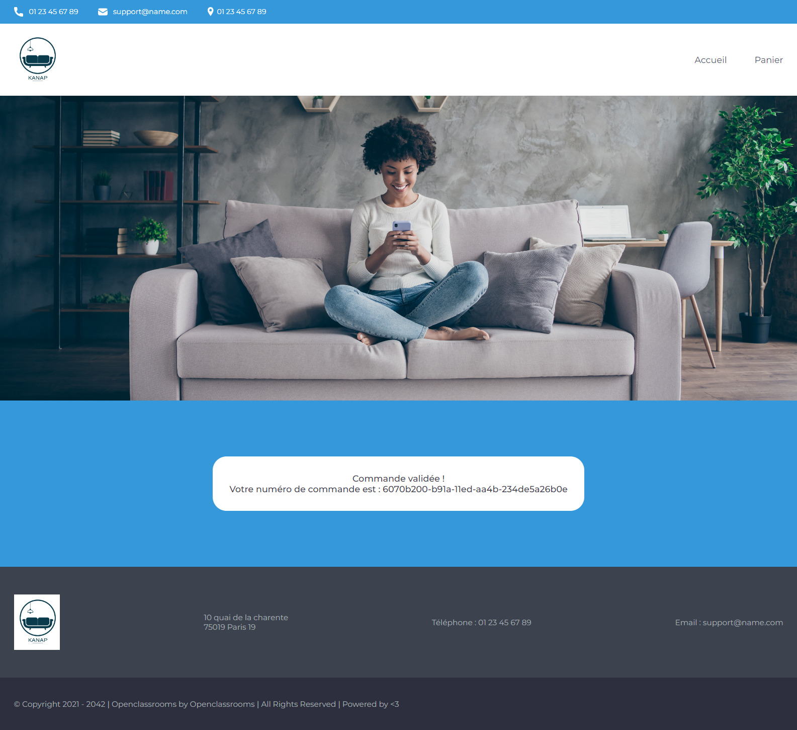

# **MyDevWebLearning-P5-project: Kanap**

Cinquième projet du parcours "Développeur web" chez OpenClassroom. L'objectif de ce projet est de construire un site e-commerce en JavaScript.
Vous trouverez [le brief complet du projet](https://openclassrooms.com/fr/paths/556/projects/675/assignment) ici. 
Vous trouverez [les specifications fonctionnelles et techniques du projet](https://course.oc-static.com/projects/DWJ_FR_P5/DW+P5+-+Specifications+fonctionnelles.pdf) ici.

#
## <ins> Objectifs </ins>

1. Créer un plan de test pour une application.
2. Valider des données issues de sources externes.
3. Interagir avec un web service avec JavaScript.
4. Gérer des événements JavaScript
## <ins>Aperçu du projet</ins>  &nbsp;

  

  &nbsp;

  

  &nbsp;

  

  &nbsp;

  

  &nbsp;

## <ins> Livrables </ins>

- Un fichier ZIP contenant le code fonctionnel du site web.
   
- Un document PDF du plan de test.

### Back end Prerequisites

You will need to have Node and `npm` installed locally on your machine.
## <ins>Pour faire tourner le projet</ins>  &nbsp;

### Installation du Back end 

Clonez ce dépôt. Depuis le dossier "back" du projet, exécutez `npm install`. Vous pourrez alors demarrer le serveur avec `node server`.
Le serveur doit fonctionner sur `localhost` avec le port par défaut `3000`.
Si le serveur s'exécute sur un autre port pour une raison quelconque, Le message suivant sera imprimé sur la console au démarrage du serveur, par ex. `Écoute sur le port 3001`..
